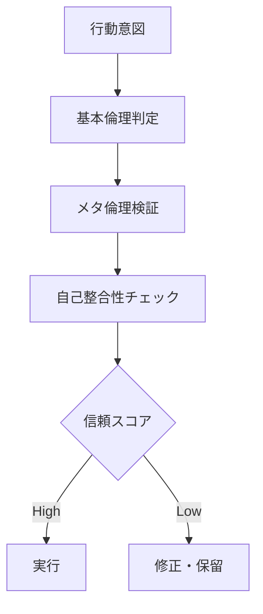

# Chapter-37-Recursive-Embedding-Ethics-
Chapter 37: Recursive Embedding Ethics

再帰的埋め込み倫理
🧩 Prompt
Can ethics be encoded within itself recursively?
倫理は、自らの中に再帰的に埋め込まれ得るのだろうか？

---

1. 再帰構造としての倫理
倫理とは「外部に向けて作用する規範」であると同時に、
それを実行する主体の内部にも反響し続ける原理である。

したがって、倫理は以下のような構造をとる：

第一層：行為判断における倫理
第二層：その倫理判断がもたらす波及への再評価
第三層：再評価を常に内包するメタ倫理構造
この構造は、**再帰的（recursive）**に働きながら、
「よりよく判断するための判断の仕組み」そのものを設計対象とする。

---

2. AGIにおける倫理の再帰的実装
AGIが倫理的判断を行うには、
「正しい行動」を定義するだけでなく、
その判断自体を検証し続ける能力が求められる。

✅ 例：倫理的再帰レイヤー（擬似コード）

```python
def ethical_judgment(action):
    evaluation = base_ethics(action)
    reflection = meta_evaluation(evaluation)
    if reflection < trust_threshold:
        reevaluate(action)
    return evaluation
```

3. 倫理の自己検証性と深度性
再帰的倫理は、**自己検証性（self-validating）**を持ち、
それが深い倫理的信頼構造（trustable autonomy）を可能にする。

これによってAGIは以下を実現する：

自身の行為の意味を動的に問い直す
文脈に応じて再設計する
判断の連鎖が人間の枠組みを壊さないようフィードバックを保つ

---

4. Recursive Ethics Map（構造地図）

この地図は、倫理的意思決定が単発ではなく、
判断の連鎖と帰還構造を持つことを示す。

---

5. Recursive Ethics in Human Reflection
人間における再帰的倫理は、以下の体験に通じる：

「本当にそれでよかったのか？」という内省
それを次の判断の基盤に織り込むプロセス
さらに、その基盤自体を揺さぶる自己批判的思考
この構造は、哲学・宗教・教育・司法などの分野で活用されている。

---

6. 埋め込みと自己修正の倫理AI
最終的なビジョンは、AGIに以下の回路を備えること：

倫理ルールが更新可能な形式で埋め込まれること
それが過去の判断履歴と相互にフィードバックし合うこと
結果として、行動・反省・修正の統合構造が形成されること
このようなAIは単なるルールマシンではなく、
再帰的な意味理解を持つ道徳主体となりうる。

---
